# Uplifted

**Give with proof, not promises.**

Uplifted is a donation platform that lets people fund verified causes and watch their money turn into something concrete — a water filter, a school meal, a surgery — instead of disappearing into a black box. Every campaign is registration-checked, every rupee is tracked against a real unit of impact, and donors, organizations, and on-site kiosks all work off the same live numbers.

🔗 **Live site:** [uplifted-three.vercel.app](https://uplifted-three.vercel.app)

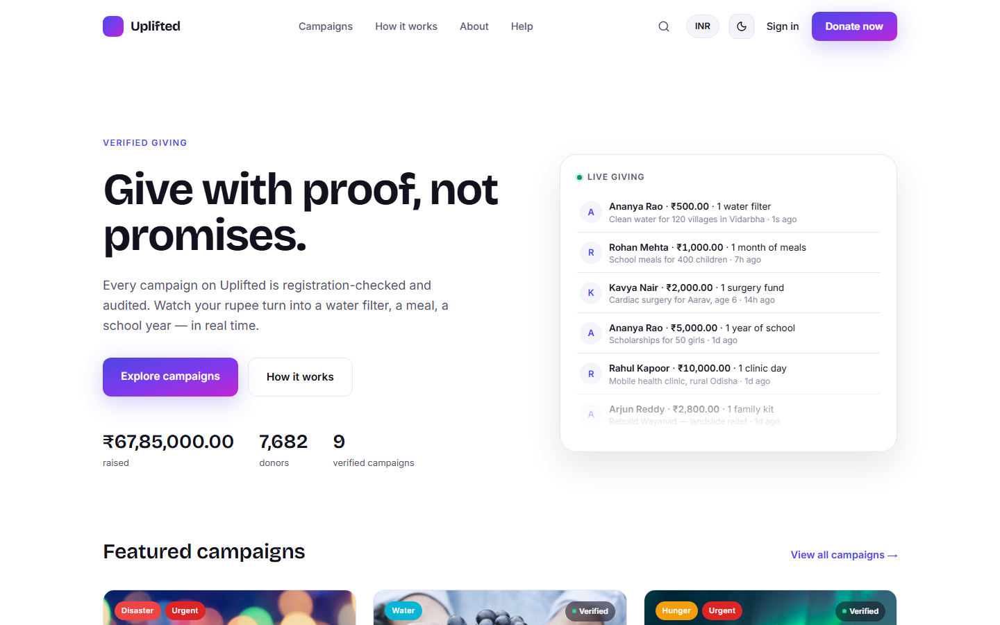

---

## What it does

### For donors

- **Browse verified campaigns** across causes — water, health, education, hunger relief, disaster response, animal welfare, environment, and women & child welfare — with search, category filters, verified/urgent toggles, and sort by trending, newest, ending soon, or closest to goal.
- **See exactly what a gift buys.** Every campaign shows a segmented progress meter — one block per unit of impact (one water filter, one school meal, one surgery) — instead of a plain percentage bar.
- **Give in four simple steps**: pick an amount (with quick-pick impact tiers or a custom figure), add your details, choose a payment method, review, and confirm. One-time or monthly giving, an option to cover the transaction fee so 100% reaches the cause, and the choice to give anonymously.
- **Get a real confirmation** — a receipt number, a thank-you page showing exactly what was funded, and an instant nudge to make it a monthly gift.
- **Track your own giving** from a personal dashboard: lifetime total given, gift history, active monthly gifts (pause or cancel anytime), saved campaigns, and account settings.
- **Switch currency and theme** — view amounts in ₹ or $, and browse in light or dark mode, anywhere in the app.

### For organizations

- **Run a full fundraising back office**: a dashboard with live revenue trends, a donation feed, top campaigns, a conversion funnel, and alerts for campaigns ending soon or devices going offline.
- **Launch a campaign in five guided steps** — basics, funding goal and impact units, story and media, giving settings, and a final review — with a live preview of exactly how the campaign card will look to donors.
- **Manage every transaction**: filterable donation and donor tables, a transaction detail view with refund support, and per-campaign analytics (funding trend, traffic sources, recent donors).
- **See the money end-to-end**: settlement balance, next payout date, and settlement history.
- **Run analytics across the whole organization**: revenue trends, channel breakdown, donor retention cohorts, and geographic spread.
- **Manage on-site kiosks**: see which devices are online, their daily totals, and pair new ones with a one-time code.

### On-site giving kiosks

- A locked-down, touch-first kiosk mode for in-person events and physical locations — big touch targets, no keyboard or mouse needed, and a rotating "raised so far today" attract screen with a live donation feed to draw people in.
- Browse causes by category, see a simplified campaign view, and give in a few taps: choose an amount, tap or scan to pay, optionally get an emailed receipt, and a thank-you screen that auto-resets for the next donor.

---

## Screenshots

<table>
<tr>
<td width="50%">

**Browse campaigns**
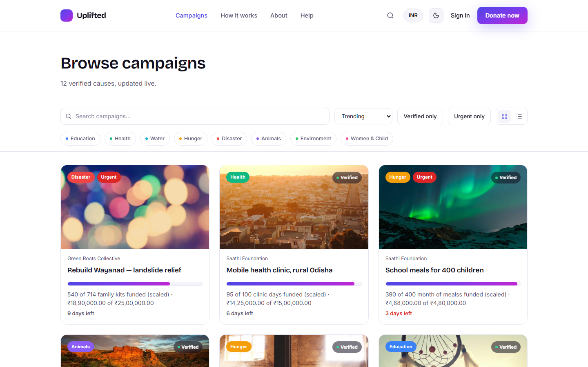

</td>
<td width="50%">

**Campaign detail**
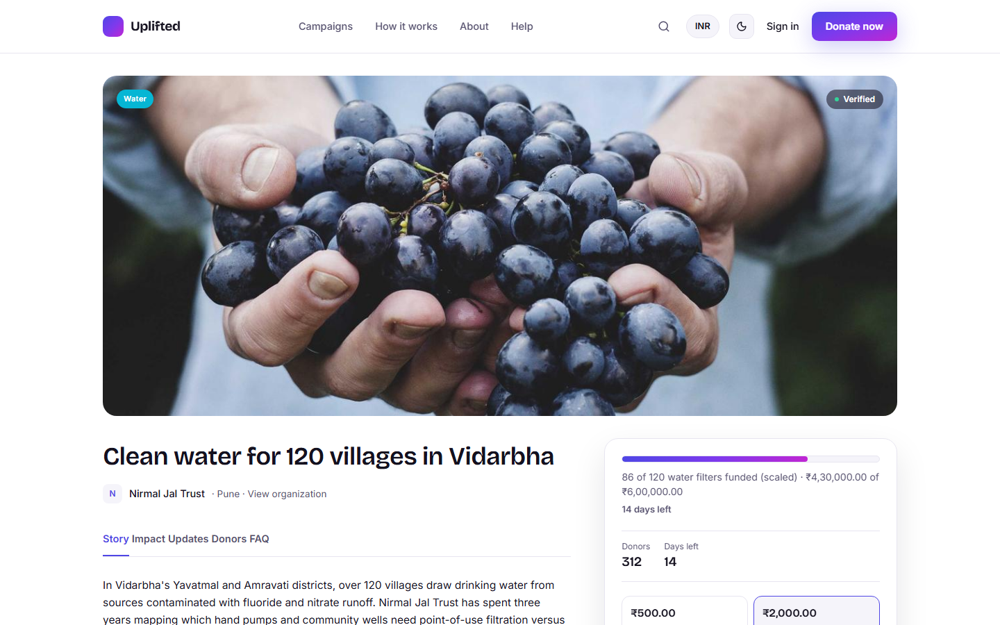

</td>
</tr>
<tr>
<td width="50%">

**Donation flow**
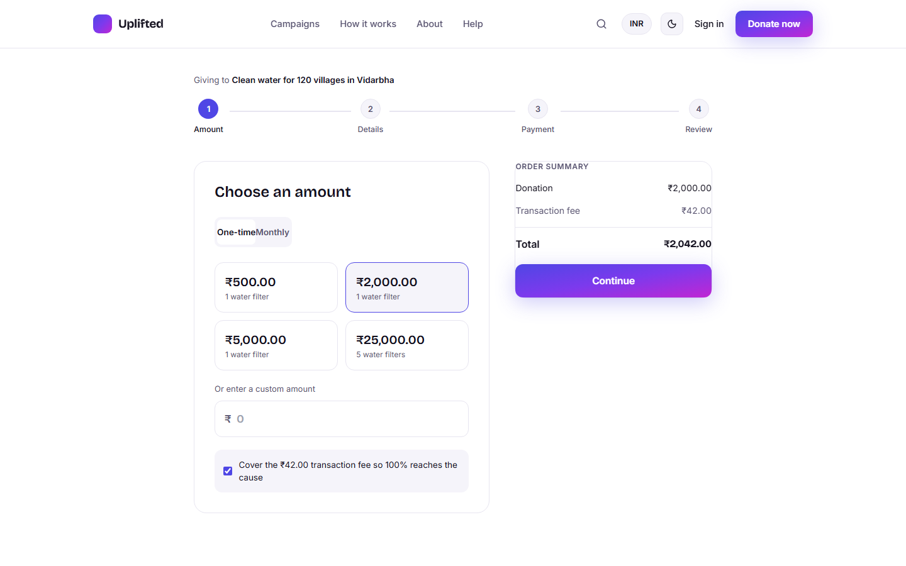

</td>
<td width="50%">

**Dark mode**
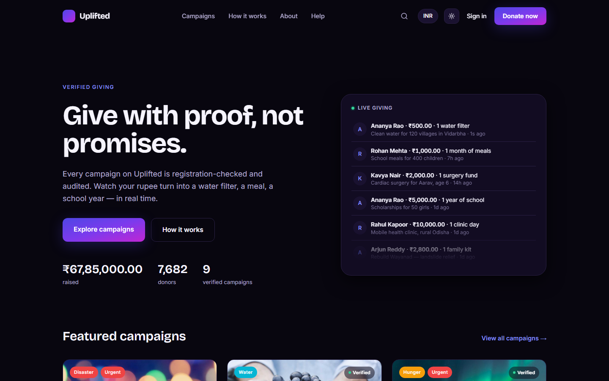

</td>
</tr>
<tr>
<td width="50%">

**Donor dashboard**
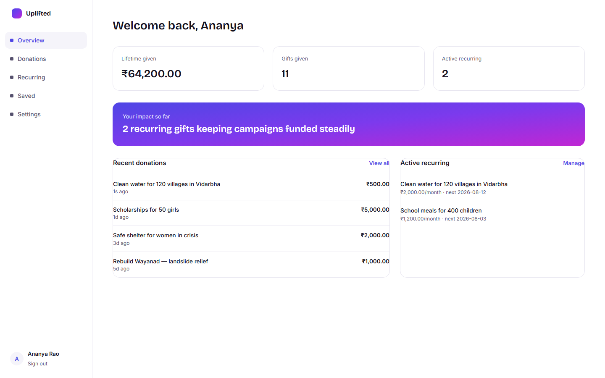

</td>
<td width="50%">

**Donation history**
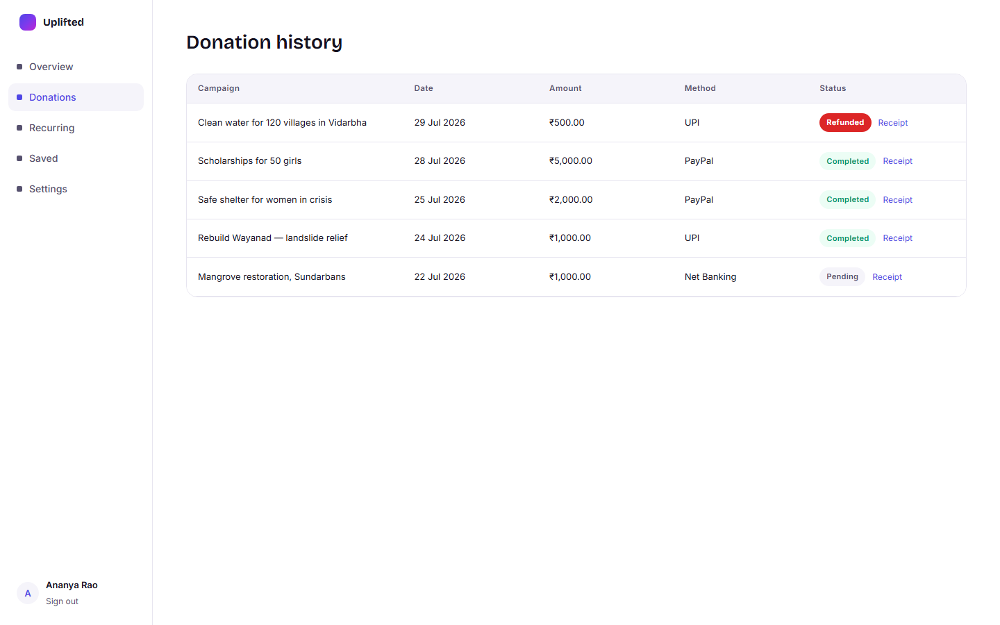

</td>
</tr>
<tr>
<td width="50%">

**Organization dashboard**
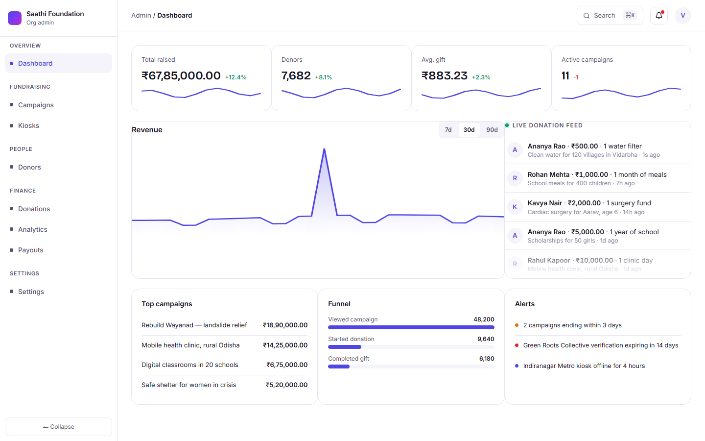

</td>
<td width="50%">

**Campaign management**
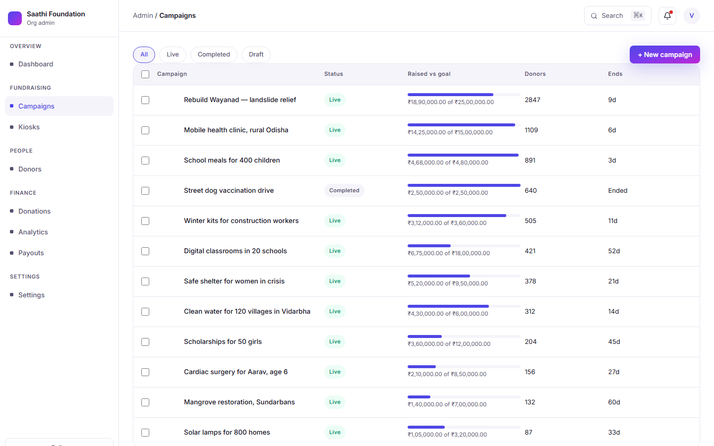

</td>
</tr>
<tr>
<td width="50%">

**Giving kiosk**
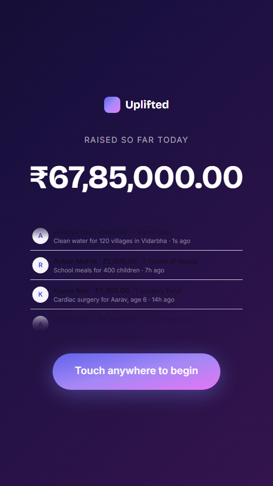

</td>
<td width="50%">

**Kiosk — choose a cause**
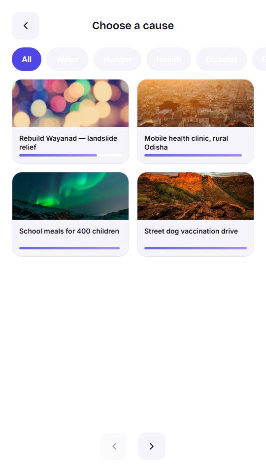

</td>
</tr>
</table>

**Mobile**

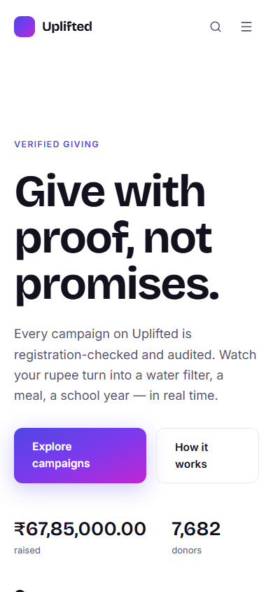

---

## Highlights

- **Live everywhere.** Recent gifts, campaign totals, and donor counts update in real time across the donor site, the organization dashboard, and the kiosk attract screen.
- **Impact you can count.** The signature progress meter always shows the actual number of units funded — filters, meals, surgeries, scholarships — not just a percentage.
- **One design language, three audiences.** The same visual system adapts from a warm public donation site to a dense operational dashboard to a locked-down touch kiosk.
- **Built for both hands.** Every screen — from the four-step donation flow to the admin data tables — is responsive down to a phone screen and accessible by keyboard, with visible focus states and screen-reader-friendly labels throughout.
- **Light and dark, ₹ and $.** Every page respects the chosen theme and currency, including the kiosk, which stays permanently dark for legibility in bright public spaces.
